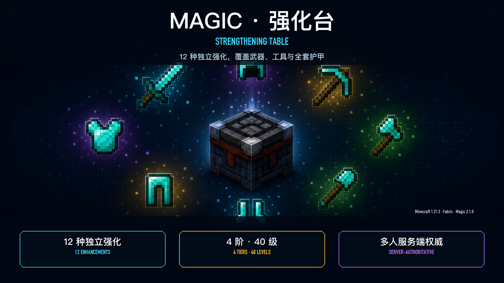
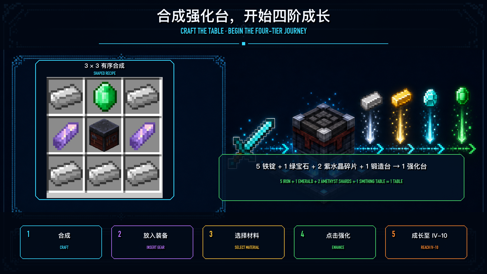
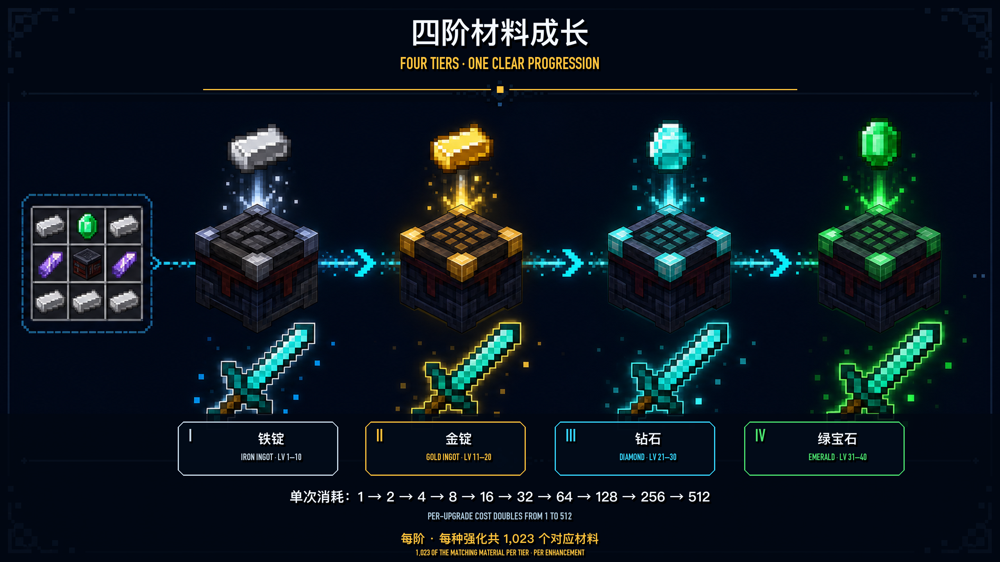
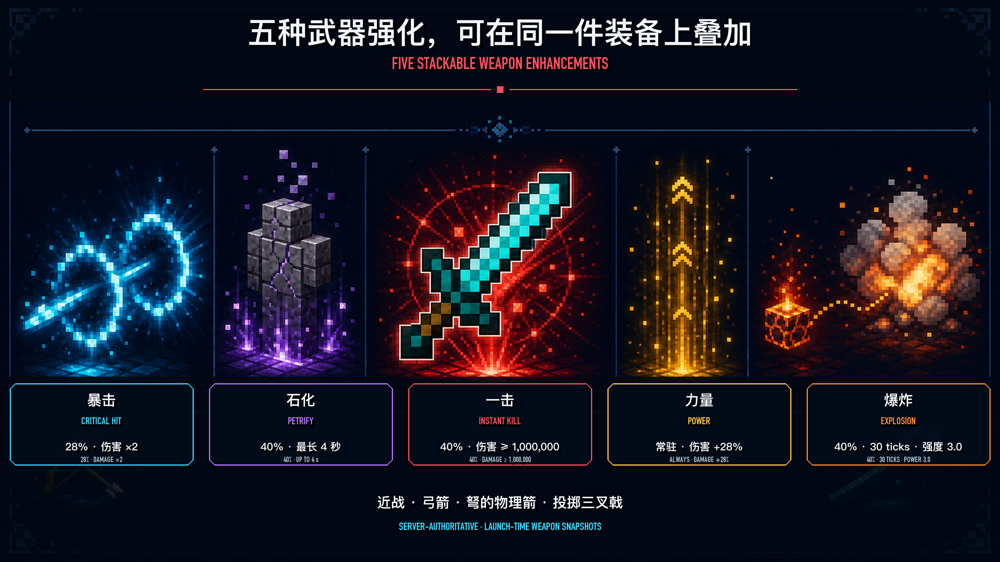
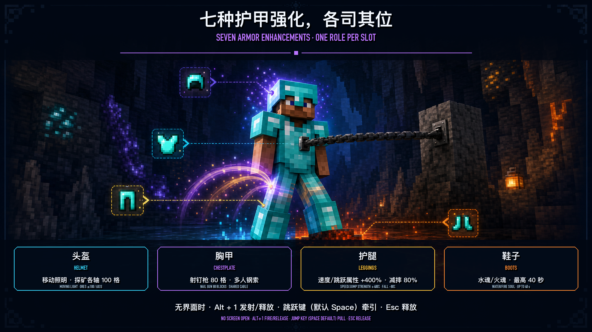

# Magic — Equipment Enhancement & Long-Term Gear Progression for Minecraft 1.21.3 Fabric

English | [简体中文](readme.md)

[](https://github.com/zoyluoblue/Minecraft_Magic/releases/latest)
[](https://github.com/zoyluoblue/Minecraft_Magic/actions/workflows/build.yml)
[](https://www.minecraft.net/)
[](https://fabricmc.net/)
[](LICENSE)

[Download the latest release](https://github.com/zoyluoblue/Minecraft_Magic/releases/latest) · [Three-minute quick start](#three-minute-quick-start) · [Explore all 12 enhancements](#12-stackable-enhancements) · [FAQ](#frequently-asked-questions)



## Magic in 30 Seconds

| Topic | Answer |
| --- | --- |
| Core loop | Explore and gather → craft the table → enhance gear → take on harder content |
| Progression | 4 tiers and 40 levels for every enhancement |
| Enhancements | 5 for weapons/tools and 7 for armor, 12 total |
| Stacking | One item can hold every compatible enhancement for its equipment slot |
| Survival materials | Tier I iron, Tier II gold, Tier III diamond, Tier IV emerald |
| Multiplayer | Upgrades, materials, combat, charge, and Nail Gun state are server-authoritative |
| Languages | English and Simplified Chinese through Minecraft's native language setting |

## Why Play Magic?

- **Long-term gear progression:** grow every enhancement from `I-1` to `IV-10` through exploration, gathering, and survival crafting.
- **12 stackable enhancements:** combat, mobility, exploration, fluid walking, and cable traversal each have a distinct role.
- **Original Astral Strengthening Table:** three rings orbit the inserted item and shift through blue, purple, pink, and orange progression colors.
- **Multiplayer-first rules:** critical outcomes resolve on the server, projectiles keep launch-time weapon snapshots, and tracking players see authoritative cable and table events.
- **Player-selected HUD:** press `F9` and choose exactly which equipment values and ore targets to display.
- **Separate from vanilla enchanting:** Magic adds an independent enhancement layer without replacing the vanilla Enchanting Table or enchantments.

## Compatibility and Installation

| Dependency | Requirement |
| --- | --- |
| Minecraft | `1.21.3` |
| Java | `21+` |
| Fabric Loader | `0.18.4+` |
| Fabric API | `0.114.1+1.21.3` or a newer 1.21.3-compatible build |
| Magic | Matching versions on client and server |

Installation:

1. Install Fabric Loader and Fabric API for Minecraft 1.21.3.
2. Download the non-`sources` Magic JAR from [GitHub Releases](https://github.com/zoyluoblue/Minecraft_Magic/releases/latest).
3. Put both the Magic JAR and Fabric API in the game's or server's `mods` directory.
4. Multiplayer requires Magic and Fabric API on both client and server, with matching Magic versions.

## Three-Minute Quick Start

### 1. Craft the Strengthening Table

Craft one table with 5 Iron Ingots, 1 Emerald, 2 Amethyst Shards, and 1 Smithing Table.

```text
I E I
A S A
I I I

I = Iron Ingot    E = Emerald
A = Amethyst Shard    S = Smithing Table
```

It is also available in the Functional Blocks creative category or through:

```mcfunction
/give @p magic:strengthening_table
```



### 2. Enhance an Item

1. Place the Strengthening Table and open it.
2. Put a compatible weapon, tool, or armor item in the left slot.
3. Select the enhancement you want to improve.
4. Put the current tier material in the right slot. Requirements above 64 combine the material slot with matching items in your inventory.
5. Select enhance when enough material is available. Upgrades always succeed and never randomly fail or damage the item.
6. Read the result in the item tooltip, or press `F9` to choose what appears in the HUD.

## Four Tiers, 40 Levels

Every enhancement progresses independently from `I-1` to `IV-10`. Minor levels 1–10 cost `1, 2, 4, 8, 16, 32, 64, 128, 256, 512`, so completing one tier costs `1,023` units of its material.



| Tier | Total levels | Material | Ring color | Full-tier cost |
| --- | ---: | --- | --- | ---: |
| I | 1–10 | Iron Ingot | Blue | 1,023 |
| II | 11–20 | Gold Ingot | Purple | 1,023 |
| III | 21–30 | Diamond | Pink | 1,023 |
| IV | 31–40 | Emerald | Orange | 1,023 |

Taking one enhancement from zero to `IV-10` costs `1,023` Iron Ingots, `1,023` Gold Ingots, `1,023` Diamonds, and `1,023` Emeralds. Insufficient material changes neither the item nor inventory. Creative mode still requires the correct selected material and full amount, but consumes nothing on success.

## 12 Stackable Enhancements

### Weapons and Tools: 5 Combat Enhancements

Swords, mining tools, bows, crossbows, tridents, and most damageable non-armor items can receive the five combat enhancements below. One compatible item can carry multiple effects at once.



| Enhancement | IV-10 effect | Key rule |
| --- | --- | --- |
| Critical Hit | 28% chance to deal ×2 damage | Resolves together with Power |
| Petrify | 40% chance to stop movement for 4 seconds | Reapplication extends the effect without stacking broken states |
| Instant Kill | 40% chance to raise vanilla damage to at least 1,000,000 | Not an unconditional `kill`; protection rules and Totems can still intervene |
| Power | +28% damage on every attack | Always active; no random trigger |
| Explosion | 40% chance to create a power 3.0 vanilla explosion after 30 server ticks | Safely cancels if the attacker becomes invalid |

These effects support melee attacks, bows, physical crossbow arrows, and thrown tridents. Crossbow fireworks keep vanilla behavior.

### Armor: 7 Exploration and Mobility Enhancements



| Slot | Enhancement | IV-10 effect | Key limit |
| --- | --- | --- | --- |
| Helmet | Illumination | Display value 10; moving vanilla light level maps to 12–15 | The display value is not a 10-block light radius |
| Helmet | Ore Seeker | Up to 100 blocks on each XYZ axis | Scans loaded client chunks only |
| Chestplate | Nail Gun | Up to 80 blocks | Requires matching client and server versions |
| Leggings | Speed | +400% base movement speed with aerial acceleration | High speed still obeys collision and terrain |
| Leggings | Jump Height | +400% base Jump Strength and 80% less fall damage | Real block height does not increase linearly by 400% |
| Boots | Water Soul | Up to 40 seconds of water-walking charge | Drains on water; recovers at one second per second away from water |
| Boots | Fire Soul | Up to 40 seconds of lava walking and burn protection | Protection ends when charge is depleted |

Water Soul and Fire Soul charge belongs to the boots and survives copying, trading, drops, reconnects, and server restarts.

## Astral Strengthening Table

The placed table uses an original pedestal, original textures, and three animated astral rings:

- The left-slot item floats at the center while small projections of the right-slot material orbit the base.
- The strongest applicable enhancement selects Tier I blue, Tier II purple, Tier III pink, or Tier IV orange; intensity rises within each tier.
- A successful upgrade converges energy into the center before releasing a tier-colored burst.
- The block still occupies `1×1`; only the roughly `12/16`-block-high base collides, so the rings do not create an invisible wall.
- Client world time drives the animation. The server syncs slot changes and success events instead of sending per-frame packets.

Tier colors currently apply to the table's rings. Full-scene tier glow for inventory items, held items, drops, or worn armor is not released, and enhanced equipment does not become a dynamic light source. Helmet Illumination is a separate enhancement.

## HUD and Nail Gun Controls

| Action | Default input | Behavior |
| --- | --- | --- |
| Open HUD selection | `F9` | A Minecraft KeyBinding that can be rebound |
| Fire/release Nail Gun | `Alt + 1` | Read only with no screen open and a Nail Gun chestplate equipped |
| Start pulling | Current jump key, `Space` by default | Press once after attaching to begin continuous pull |
| Release Nail Gun | Press `Alt + 1` again or `Esc` | Arrival, obstruction, timeout, death, or dimension change also releases it |

The `F9` screen groups main hand, off hand, helmet, chestplate, leggings, and boots. After the player selects entries, the lower-left HUD shows equipment slot, item name, enhancement, level, and value; Ore Seeker guidance appears at the top of the screen. HUD and ore-target choices last for the current client session only and must be selected again after restart.

## Multiplayer and Reliability

- Enhancement upgrades, material consumption, combat effects, Soul charge, mobile lighting, and Nail Gun state are server-authoritative.
- Ranged attacks keep a launch-time weapon snapshot. Swapping, dropping, or editing the source weapon while an arrow or trident is in flight does not change that hit.
- Critical feedback, Petrify, delayed Explosion, and Instant Kill effects commit only after vanilla accepts the damage, leaving PvP, team rules, Creative mode, and Totems in control.
- Nail Gun commands are sequenced, idempotent, and rate-limited. Nearby tracking clients see the same authoritative cable state.
- The table uses vanilla BlockEntity updates and block events for slot and success feedback instead of per-frame network synchronization.

## Demo Video

[Watch the Minecraft Magic gameplay demo on YouTube](https://www.youtube.com/watch?v=J3A4pPPDw4k)

## Frequently Asked Questions

### What is Magic?

Magic is an equipment enhancement and long-term gear progression mod for Minecraft 1.21.3 Fabric, featuring an original Strengthening Table, four tiers, 40 levels, 12 stackable enhancements, and server-authoritative multiplayer rules.

### Does Magic replace the vanilla Enchanting Table or enchantments?

No. Magic adds a separate Strengthening Table and progression layer while vanilla enchanting remains available.

### Which Minecraft, Fabric, and Java versions are supported?

The current release supports Minecraft `1.21.3`, Java `21+`, Fabric Loader `0.18.4+`, and Fabric API `0.114.1+1.21.3` or a newer compatible 1.21.3 build.

### Do both client and server need the mod?

Yes. Multiplayer requires Magic and Fabric API on both client and server, with matching Magic versions.

### Does Magic support multiplayer servers?

Yes. Upgrades, materials, combat, charge, mobile lighting, and Nail Gun state all resolve on the server.

### Can one item stack multiple enhancements?

Yes, but only enhancements supported by that equipment slot. A sword can carry all five combat enhancements, while boots can carry Water Soul and Fire Soul together.

### Can enhancement fail, downgrade, or damage an item?

No. An upgrade always succeeds when the item, level, and material requirements are met. There is currently no random failure, downgrade, or item-break mechanic.

### What happens when one upgrade costs more than 64 materials?

Select the correct material in the material slot. The table combines matching items from that slot and the player's inventory, then deducts them as one transaction. Insufficient material changes nothing.

### Can Magic be added to an existing world?

Existing Minecraft 1.21.3 Fabric worlds and earlier Magic items can load in this version, and the mod does not change world generation. Back up before updating, and do not downgrade an important world without a backup.

### Do enhanced items glow by tier or light the environment?

Not yet. Only the table rings use the blue, purple, pink, and orange tier colors. Full-scene equipment glow is not released and equipment is not a dynamic light source; Helmet Illumination is separate.

### Where can I download the latest version or report a problem?

Download from [GitHub Releases](https://github.com/zoyluoblue/Minecraft_Magic/releases/latest). Report reproducible issues with logs through [GitHub Issues](https://github.com/zoyluoblue/Minecraft_Magic/issues).

## Development and Verification

<details>
<summary>Build, test, and verification details</summary>

```bash
./gradlew clean build --no-daemon --stacktrace
./gradlew runGameTest --no-daemon --stacktrace
```

The release build compiles Java, processes resources, packages the JAR, verifies English/Chinese translation-key parity, and enforces the original Astral Table resource gate. The current Dedicated Server suite contains 34 GameTests covering material transactions, persistence, combat, ranged weapon snapshots, temporary effects, the Nail Gun state machine, and Strengthening Table visual-state contracts.

</details>

## Download, Support, and License

- [Download the latest release](https://github.com/zoyluoblue/Minecraft_Magic/releases/latest)
- [Check build status](https://github.com/zoyluoblue/Minecraft_Magic/actions)
- [Open an issue](https://github.com/zoyluoblue/Minecraft_Magic/issues)
- Open-source license: [MIT](LICENSE)

Magic is an unofficial Minecraft mod and is not affiliated with, endorsed by, or associated with Mojang Studios or Microsoft.
