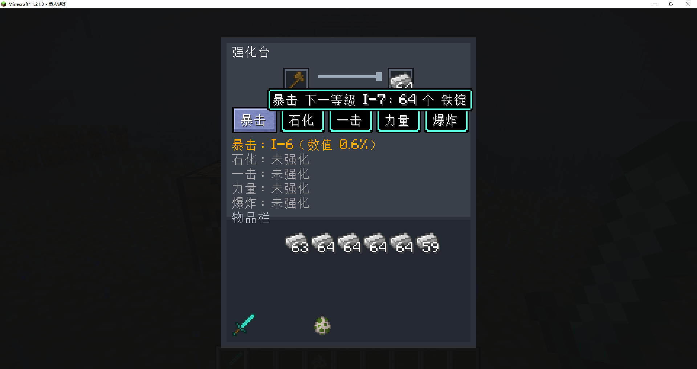
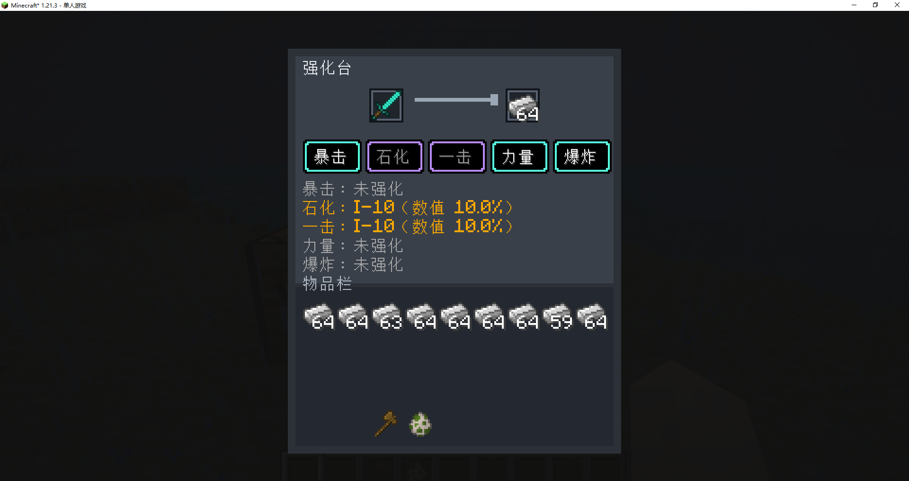
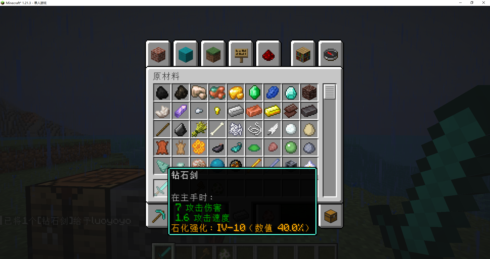
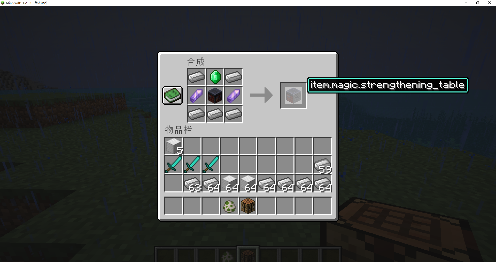

# Magic 强化台模组规则说明

这是一个 Minecraft 1.21.3 Fabric 模组，基于 Fabric Loader 0.18.4。模组新增功能方块“强化台”，用于给工具和武器添加独立强化属性。

## 演示

<video src="[./demo/magic.mp4](https://www.youtube.com/watch?v=J3A4pPPDw4k)" controls width="100%"></video>

[无法播放时点击查看演示视频](https://www.youtube.com/watch?v=J3A4pPPDw4k)










## 版本信息

- Minecraft：1.21.3
- Fabric Loader：0.18.4
- Fabric API：0.114.1+1.21.3
- 模组 ID：`magic`
- 强化台方块 ID：`magic:strengthening_table`
- 打包文件：`build/libs/magic-fabric-1.21.3-loader0.18.4-1.0.0.jar`

## 强化台获取方式

### 创造模式获取

创造模式打开物品栏，在“功能性方块”分类里可以找到“强化台”。它会显示在原版“锻造台”后面。

也可以使用命令获取：

```mcfunction
/give @p magic:strengthening_table
```

### 生存模式合成

强化台使用有序合成，合成布局如下：

```text
铁锭       绿宝石       铁锭
紫水晶碎片 锻造台       紫水晶碎片
铁锭       铁锭         铁锭
```

配方符号：

| 符号 | 物品 |
| --- | --- |
| `I` | 铁锭 |
| `E` | 绿宝石 |
| `A` | 紫水晶碎片 |
| `S` | 锻造台 |

实际配方：

```text
I E I
A S A
I I I
```

单个强化台需要：

| 材料 | 数量 |
| --- | ---: |
| 铁锭 | 5 |
| 绿宝石 | 1 |
| 紫水晶碎片 | 2 |
| 锻造台 | 1 |

## 强化台界面规则

强化台有两个槽位：

| 槽位 | 用途 | 规则 |
| --- | --- | --- |
| 左侧槽位 | 放入工具或武器 | 每次只能放 1 个可强化物品 |
| 右侧槽位 | 放入强化材料 | 必须放入当前升级所需的材料 |

可强化物品包括：

- 剑、镐、斧、锹、锄等工具。
- 弓、弩、三叉戟等武器。
- 其他具有耐久度的非护甲物品。

不可强化物品：

- 护甲。
- 鞘翅。
- 没有耐久度且不属于工具或武器的普通物品。

界面中有 5 个中文强化按钮：

| 按钮 | 强化类型 |
| --- | --- |
| 暴击 | 暴击率强化 |
| 石化 | 石化概率强化 |
| 一击 | 一击必杀概率强化 |
| 力量 | 伤害加成强化 |
| 爆炸 | 爆炸概率强化 |

点击某个按钮时，只强化对应类型。5 种强化互相独立，同一件武器可以同时拥有多种强化。

## 强化等级规则

每种强化都有 4 个大等级，每个大等级有 10 个小等级。

等级显示格式：

```text
大等级-小等级
```

示例：

| 显示 | 含义 | 总等级 |
| --- | --- | ---: |
| `I-1` | 第 1 大等级第 1 小等级 | 1 |
| `I-10` | 第 1 大等级第 10 小等级 | 10 |
| `II-1` | 第 2 大等级第 1 小等级 | 11 |
| `III-10` | 第 3 大等级第 10 小等级 | 30 |
| `IV-10` | 第 4 大等级第 10 小等级 | 40 |

总等级计算：

```text
总等级 = (大等级 - 1) * 10 + 小等级
```

最大等级：

```text
IV-10 = 40 级
```

升级顺序：

```text
未强化 -> I-1 -> I-2 -> ... -> I-10 -> II-1 -> ... -> IV-10
```

## 强化材料规则

每种强化的材料规则完全一致，只是强化类型独立计算。

| 大等级 | 等级范围 | 所需材料 |
| --- | --- | --- |
| I | 1-10 级 | 铁锭 |
| II | 11-20 级 | 金锭 |
| III | 21-30 级 | 钻石 |
| IV | 31-40 级 | 绿宝石 |

每个大等级内部，小等级消耗数量按 2 倍递增：

```text
目标小等级消耗 = 2 ^ (目标小等级 - 1)
```

也就是：

| 目标小等级 | 单次升级消耗 |
| ---: | ---: |
| 1 | 1 |
| 2 | 2 |
| 3 | 4 |
| 4 | 8 |
| 5 | 16 |
| 6 | 32 |
| 7 | 64 |
| 8 | 128 |
| 9 | 256 |
| 10 | 512 |

同一个大等级从 1 级升满 10 级，总材料消耗：

```text
1 + 2 + 4 + 8 + 16 + 32 + 64 + 128 + 256 + 512 = 1023
```

单种强化升到满级 `IV-10` 的总材料：

| 材料 | 数量 |
| --- | ---: |
| 铁锭 | 1023 |
| 金锭 | 1023 |
| 钻石 | 1023 |
| 绿宝石 | 1023 |

5 种强化全部升满时，总材料为：

| 材料 | 数量 |
| --- | ---: |
| 铁锭 | 5115 |
| 金锭 | 5115 |
| 钻石 | 5115 |
| 绿宝石 | 5115 |

注意：

- 材料槽必须至少放入 1 个当前等级需要的材料。
- 如果升级需要超过 64 个材料，强化台会从材料槽和玩家背包中一起统计并扣除。
- 创造模式玩家点击强化按钮时不会消耗材料。

## 完整升级材料表

| 总等级 | 显示等级 | 单次升级材料 | 单次消耗 |
| ---: | --- | --- | ---: |
| 1 | I-1 | 铁锭 | 1 |
| 2 | I-2 | 铁锭 | 2 |
| 3 | I-3 | 铁锭 | 4 |
| 4 | I-4 | 铁锭 | 8 |
| 5 | I-5 | 铁锭 | 16 |
| 6 | I-6 | 铁锭 | 32 |
| 7 | I-7 | 铁锭 | 64 |
| 8 | I-8 | 铁锭 | 128 |
| 9 | I-9 | 铁锭 | 256 |
| 10 | I-10 | 铁锭 | 512 |
| 11 | II-1 | 金锭 | 1 |
| 12 | II-2 | 金锭 | 2 |
| 13 | II-3 | 金锭 | 4 |
| 14 | II-4 | 金锭 | 8 |
| 15 | II-5 | 金锭 | 16 |
| 16 | II-6 | 金锭 | 32 |
| 17 | II-7 | 金锭 | 64 |
| 18 | II-8 | 金锭 | 128 |
| 19 | II-9 | 金锭 | 256 |
| 20 | II-10 | 金锭 | 512 |
| 21 | III-1 | 钻石 | 1 |
| 22 | III-2 | 钻石 | 2 |
| 23 | III-3 | 钻石 | 4 |
| 24 | III-4 | 钻石 | 8 |
| 25 | III-5 | 钻石 | 16 |
| 26 | III-6 | 钻石 | 32 |
| 27 | III-7 | 钻石 | 64 |
| 28 | III-8 | 钻石 | 128 |
| 29 | III-9 | 钻石 | 256 |
| 30 | III-10 | 钻石 | 512 |
| 31 | IV-1 | 绿宝石 | 1 |
| 32 | IV-2 | 绿宝石 | 2 |
| 33 | IV-3 | 绿宝石 | 4 |
| 34 | IV-4 | 绿宝石 | 8 |
| 35 | IV-5 | 绿宝石 | 16 |
| 36 | IV-6 | 绿宝石 | 32 |
| 37 | IV-7 | 绿宝石 | 64 |
| 38 | IV-8 | 绿宝石 | 128 |
| 39 | IV-9 | 绿宝石 | 256 |
| 40 | IV-10 | 绿宝石 | 512 |

## 强化数值显示规则

所有强化都会在物品 tooltip 中显示：

```text
强化类型强化：等级（数值 百分比）
```

示例：

```text
暴击强化：IV-10（数值 28.0%）
石化强化：IV-10（数值 40.0%）
```

不同强化的“数值”含义不同：

| 强化类型 | 数值含义 |
| --- | --- |
| 暴击 | 暴击触发概率 |
| 石化 | 石化触发概率 |
| 一击 | 一击必杀触发概率 |
| 力量 | 直接伤害加成比例 |
| 爆炸 | 爆炸触发概率 |

## 暴击数值计算

暴击使用分段权重计算，不是简单每级固定 1%。

每个小等级增加的暴击率：

| 大等级 | 每个小等级增加 |
| --- | ---: |
| I | 0.1% |
| II | 0.2% |
| III | 0.5% |
| IV | 2.0% |

计算公式：

```text
暴击率 =
  I 阶已强化小等级数 * 0.1%
+ II 阶已强化小等级数 * 0.2%
+ III 阶已强化小等级数 * 0.5%
+ IV 阶已强化小等级数 * 2.0%
```

关键等级示例：

| 等级 | 暴击率 |
| --- | ---: |
| I-1 | 0.1% |
| I-10 | 1.0% |
| II-1 | 1.2% |
| II-10 | 3.0% |
| III-1 | 3.5% |
| III-10 | 8.0% |
| IV-1 | 10.0% |
| IV-10 | 28.0% |

触发效果：

```text
触发暴击时，本次攻击最终伤害 * 2
```

也就是增加 100% 伤害。

## 石化数值计算

石化使用总等级直接计算概率。

计算公式：

```text
石化概率 = 总等级 * 1%
```

最高等级 `IV-10` 为 40 级，因此最高石化概率为：

```text
40 * 1% = 40%
```

石化持续时间：

```text
持续秒数 = ceil(总等级 / 10)
```

持续时间按真实世界时间计算，不按游戏内白天黑夜时间计算。

| 总等级范围 | 石化持续时间 |
| --- | ---: |
| 1-10 | 1 秒 |
| 11-20 | 2 秒 |
| 21-30 | 3 秒 |
| 31-40 | 4 秒 |

触发效果：

- 目标被施加最高等级缓慢效果。
- 目标速度会被持续归零。
- 到达真实时间截止后解除控制。

示例：

```text
石化 IV-10 = 总等级 40
石化概率 = 40%
持续时间 = ceil(40 / 10) = 4 秒
```

## 一击数值计算

一击使用总等级直接计算概率。

计算公式：

```text
一击必杀概率 = 总等级 * 1%
```

最高等级 `IV-10` 为 40 级，因此最高一击必杀概率为：

```text
40 * 1% = 40%
```

触发效果：

```text
目标直接死亡
```

如果一击和其他效果在同一次攻击中同时触发，以目标直接死亡为主。

## 力量数值计算

力量的数值计算方式与暴击完全一致，但力量不是概率效果。

每个小等级增加的伤害：

| 大等级 | 每个小等级增加 |
| --- | ---: |
| I | 0.1% |
| II | 0.2% |
| III | 0.5% |
| IV | 2.0% |

计算公式：

```text
力量伤害加成 =
  I 阶已强化小等级数 * 0.1%
+ II 阶已强化小等级数 * 0.2%
+ III 阶已强化小等级数 * 0.5%
+ IV 阶已强化小等级数 * 2.0%
```

关键等级示例：

| 等级 | 伤害加成 |
| --- | ---: |
| I-1 | 0.1% |
| I-10 | 1.0% |
| II-10 | 3.0% |
| III-10 | 8.0% |
| IV-10 | 28.0% |

触发规则：

```text
力量不需要触发，每次攻击都会生效。
```

伤害计算：

```text
强化后伤害 = 原本本次攻击伤害 * (1 + 力量伤害加成)
```

示例：

```text
原本伤害 = 10
力量 IV-10 = 28.0%
强化后伤害 = 10 * (1 + 28.0%) = 12.8
```

如果同一次攻击还触发暴击：

```text
最终伤害 = 原本本次攻击伤害 * (1 + 力量伤害加成) * 2
```

## 爆炸数值计算

爆炸使用总等级直接计算概率。

计算公式：

```text
爆炸概率 = 总等级 * 1%
```

最高等级 `IV-10` 为 40 级，因此最高爆炸概率为：

```text
40 * 1% = 40%
```

触发效果：

- 目标会播放类似苦力怕引爆的声音。
- 目标会在延迟后发生爆炸。
- 爆炸发生后目标死亡。

当前实现参数：

| 参数 | 数值 |
| --- | ---: |
| 爆炸引信 | 30 个服务器 tick |
| 爆炸强度 | 3.0 |
| 爆炸来源类型 | 生物爆炸 |

如果爆炸触发但本次攻击原本足以击杀目标，模组会阻止这一刀直接击杀目标，确保延迟爆炸能够发生。

## 五种强化满级数值汇总

| 强化类型 | 满级 | 满级数值 | 满级效果 |
| --- | --- | ---: | --- |
| 暴击 | IV-10 | 28.0% | 28.0% 概率使本次伤害翻倍 |
| 石化 | IV-10 | 40.0% | 40.0% 概率停止目标移动 4 秒 |
| 一击 | IV-10 | 40.0% | 40.0% 概率直接击杀目标 |
| 力量 | IV-10 | 28.0% | 每次攻击直接增加 28.0% 伤害 |
| 爆炸 | IV-10 | 40.0% | 40.0% 概率使目标延迟爆炸并死亡 |

## 创造模式指定等级命令

强化数据存储在物品的 `minecraft:custom_data` 中。

数据根节点：

```text
MagicEnhancements
```

强化类型 ID：

| 强化类型 | NBT ID |
| --- | --- |
| 暴击 | `crit` |
| 石化 | `petrify` |
| 一击 | `instant_kill` |
| 力量 | `power` |
| 爆炸 | `explosion` |

等级字段：

| 字段 | 含义 |
| --- | --- |
| `Major` | 大等级，范围 1-4 |
| `Minor` | 小等级，范围 1-10 |

由总等级换算为 `Major` 和 `Minor`：

```text
Major = ceil(总等级 / 10)
Minor = ((总等级 - 1) % 10) + 1
```

给一把钻石剑设置单个强化示例：

```mcfunction
/give @p minecraft:diamond_sword[minecraft:custom_data={MagicEnhancements:{crit:{Major:2,Minor:5}}}] 1
```

这个命令会生成：

```text
暴击 II-5
```

给一把钻石剑设置五种强化全部满级：

```mcfunction
/give @p minecraft:diamond_sword[minecraft:custom_data={MagicEnhancements:{crit:{Major:4,Minor:10},petrify:{Major:4,Minor:10},instant_kill:{Major:4,Minor:10},power:{Major:4,Minor:10},explosion:{Major:4,Minor:10}}}] 1
```

给一把下界合金剑设置自定义等级示例：

```mcfunction
/give @p minecraft:netherite_sword[minecraft:custom_data={MagicEnhancements:{crit:{Major:4,Minor:10},petrify:{Major:2,Minor:10},instant_kill:{Major:1,Minor:5},power:{Major:3,Minor:10},explosion:{Major:4,Minor:1}}}] 1
```

对应效果：

| 强化类型 | 等级 | 数值 |
| --- | --- | ---: |
| 暴击 | IV-10 | 28.0% |
| 石化 | II-10 | 20.0% |
| 一击 | I-5 | 5.0% |
| 力量 | III-10 | 8.0% |
| 爆炸 | IV-1 | 31.0% |

## 使用流程示例

1. 合成或获取强化台。
2. 将强化台放置在世界中。
3. 右键打开强化台。
4. 左侧槽位放入要强化的工具或武器。
5. 右侧槽位放入当前等级需要的材料。
6. 点击“暴击”“石化”“一击”“力量”或“爆炸”按钮。
7. 强化成功后，物品 tooltip 会显示新的强化等级和数值。

示例：把一把钻石剑的暴击从未强化升到 `I-3`：

| 步骤 | 目标等级 | 材料 | 数量 |
| ---: | --- | --- | ---: |
| 1 | I-1 | 铁锭 | 1 |
| 2 | I-2 | 铁锭 | 2 |
| 3 | I-3 | 铁锭 | 4 |

总消耗：

```text
铁锭 7 个
```

最终暴击率：

```text
I-3 = 3 * 0.1% = 0.3%
```

## 构建

在项目根目录执行：

```sh
./gradlew build
```

构建后的可用模组 jar 位于：

```text
build/libs/magic-fabric-1.21.3-loader0.18.4-1.0.0.jar
```

## 鞋子强化补充说明

鞋子现在可以放入强化台左侧槽位进行强化。放入鞋子时，强化台会显示 4 个中文强化按钮：

| 按钮 | 强化类型 | NBT ID |
| --- | --- | --- |
| 速度 | 移动速度强化 | `speed` |
| 高度 | 跳跃高度强化 | `height` |
| 水魂 | 水上行走时间强化 | `water_soul` |
| 火魂 | 火上行走时间和防灼烧强化 | `fire_soul` |

鞋子强化的等级、材料和升级消耗规则与暴击强化一致：

| 大等级 | 等级范围 | 所需材料 |
| --- | --- | --- |
| I | 1-10 级 | 铁锭 |
| II | 11-20 级 | 金锭 |
| III | 21-30 级 | 钻石 |
| IV | 31-40 级 | 绿宝石 |

每个大等级内部，小等级消耗数量仍为：

```text
目标小等级消耗 = 2 ^ (目标小等级 - 1)
```

### 速度

每强化 1 级，走路和跑步速度增加 10%。跳跃腾空期间也会获得对应的空中加速，因此强化后的鞋子可以跳得更远。

计算公式：

```text
速度加成 = 总等级 * 10%
```

满级 `IV-10` 为 40 级，因此最高速度加成为：

```text
40 * 10% = 400%
```

### 高度

每强化 1 级，可跳跃高度增加 10%。

计算公式：

```text
跳跃高度加成 = 总等级 * 10%
```

高度强化还会降低高空摔落伤害。

```text
摔落伤害降低比例 = 总等级 * 2 / 100
```

满级 `IV-10` 时：

```text
跳跃高度加成 = 400%
摔落伤害降低 = 80%
实际承受摔落伤害 = 原伤害 * 20%
```

### 水魂

强化后可以在水上行走和跑步。每强化 1 级，可在水上行走的时间增加 1 秒，按真实世界时间计算。

```text
水上行走秒数上限 = 总等级
```

剩余时间恢复规则：

- 在水上行走时，每 1 秒消耗 1 秒剩余时间。
- 离开水面后，每 1 秒恢复 1 秒剩余时间。
- 最多恢复到当前强化等级的上限。
- 脱下鞋子不会直接回满，也只能按每秒 1 秒慢慢恢复。

### 火魂

强化后可以在岩浆上行走和跑步，并免疫火焰、岩浆、灼烧、营火和岩浆块造成的灼烧伤害。每强化 1 级，可在火上行走的时间增加 1 秒，按真实世界时间计算。

```text
火上行走秒数上限 = 总等级
```

剩余时间恢复规则：

- 在岩浆上行走时，每 1 秒消耗 1 秒剩余时间。
- 离开岩浆后，每 1 秒恢复 1 秒剩余时间。
- 最多恢复到当前强化等级的上限。
- 脱下鞋子不会直接回满，也只能按每秒 1 秒慢慢恢复。

### 左下角显示

玩家持有或装备已强化物品时，左下角会从上到下显示装备位置、物品名称、强化类型、强化等级和强化数值。

水魂、火魂会显示剩余秒数。比如 `I-10` 的水魂上限为 10 秒，开始在水上行走后会显示倒计时。

按 `F9` 会打开强化数值显示选择界面。每条可显示数值右侧都可以切换“开启”或“关闭”；点击“确定”后只显示开启的数值，点击“取消”则关闭所有左下角强化数值显示。

### 鞋子强化获取代码

给一双钻石鞋设置四种鞋子强化全部满级：

```mcfunction
/give @p minecraft:diamond_boots[minecraft:custom_data={MagicEnhancements:{speed:{Major:4,Minor:10},height:{Major:4,Minor:10},water_soul:{Major:4,Minor:10},fire_soul:{Major:4,Minor:10}}}] 1
```

给一双下界合金鞋设置四种鞋子强化全部满级：

```mcfunction
/give @p minecraft:netherite_boots[minecraft:custom_data={MagicEnhancements:{speed:{Major:4,Minor:10},height:{Major:4,Minor:10},water_soul:{Major:4,Minor:10},fire_soul:{Major:4,Minor:10}}}] 1
```

给一双下界合金鞋设置自定义等级：

```mcfunction
/give @p minecraft:netherite_boots[minecraft:custom_data={MagicEnhancements:{speed:{Major:4,Minor:10},height:{Major:2,Minor:10},water_soul:{Major:1,Minor:10},fire_soul:{Major:3,Minor:10}}}] 1
```

对应效果：

| 强化类型 | 等级 | 数值 |
| --- | --- | ---: |
| 速度 | IV-10 | 400.0% |
| 高度 | II-10 | 200.0%，摔落伤害降低 40.0% |
| 水魂 | I-10 | 10 秒 |
| 火魂 | III-10 | 30 秒 |

只设置水魂 `I-10` 的钻石鞋：

```mcfunction
/give @p minecraft:diamond_boots[minecraft:custom_data={MagicEnhancements:{water_soul:{Major:1,Minor:10}}}] 1
```

只设置火魂 `I-10` 的钻石鞋：

```mcfunction
/give @p minecraft:diamond_boots[minecraft:custom_data={MagicEnhancements:{fire_soul:{Major:1,Minor:10}}}] 1
```

## 当前护甲强化完整说明

本节按当前模组功能整理护甲强化规则。护甲类物品也可以放入强化台左侧槽位，材料、等级和消耗规则与武器强化一致：4 个大等级，每个大等级 10 个小等级，最高 `IV-10`，总等级最高 40 级。

### 护甲可强化类型

| 装备部位 | 强化按钮 | NBT ID | 满级数值 |
| --- | --- | --- | --- |
| 鞋子 | 水魂 | `water_soul` | 40 秒水上行走 |
| 鞋子 | 火魂 | `fire_soul` | 40 秒岩浆行走和防灼烧 |
| 护腿/裤子 | 速度 | `speed` | 400.0% 移动加成 |
| 护腿/裤子 | 高度 | `height` | 400.0% 跳跃加成，80.0% 摔落伤害降低 |
| 头盔 | 照明 | `illumination` | 10 格移动照明范围 |
| 头盔 | 探矿 | `ore_seeker` | 100.0 格探测范围 |
| 胸甲/衣服 | 射钉枪 | `nail_gun` | 80.0 格射程 |

### 鞋子

鞋子只支持 `水魂` 和 `火魂`。

水魂：

```text
水上行走秒数 = 总等级，最高 40 秒
```

- 可以在水面行走和跑步。
- 在水上时每 1 秒消耗 1 秒剩余时间。
- 离开水后每 1 秒恢复 1 秒剩余时间。
- 脱下鞋子不会立即回满，只能按恢复规则慢慢恢复。

火魂：

```text
岩浆行走秒数 = 总等级，最高 40 秒
```

- 可以在任意岩浆表面行走和跑步。
- 有火魂强化时免疫火焰、岩浆、灼烧、营火和岩浆块伤害。
- 在岩浆上时每 1 秒消耗 1 秒剩余时间。
- 离开岩浆后每 1 秒恢复 1 秒剩余时间。
- 脱下鞋子不会立即回满，只能按恢复规则慢慢恢复。

### 护腿/裤子

护腿/裤子支持 `速度` 和 `高度`。

速度：

```text
速度加成 = 总等级 * 10%，最高 400.0%
```

- 走路和跑步都会获得速度加成。
- 跳跃腾空期间也会获得空中加速，因此会跳得更远。

高度：

```text
跳跃高度加成 = 总等级 * 10%，最高 400.0%
摔落伤害降低 = 总等级 * 2%，最高 80.0%
```

满级 `IV-10` 时只承受 20.0% 摔落伤害。

### 头盔

头盔支持 `照明` 和 `探矿`。

照明：

```text
照明范围 = ceil(总等级 / 4)，最高 10 格
```

- 佩戴照明头盔时，会在玩家周围产生类似火把的可见亮度。
- 强化等级越高，周围可照亮范围越大。

探矿：

```text
探测范围 = 总等级 * 2.5 格，最高 100.0 格
```

- 支持探测：钻石、金子、铁、黑曜石、绿宝石。
- 按 `F9` 打开强化数值显示选择界面，在“头盔 -> 探矿”下面选择要探测的矿物。
- 佩戴有探矿强化的头盔后，屏幕上方会显示小箭头、矿物名称、距离和上下方向。
- 多种矿物同时启用时，会指向选中目标中距离最近的矿物。

### 胸甲/衣服

胸甲/衣服支持 `射钉枪`。

```text
射程 = 总等级 * 2 格，最高 80.0 格
```

操作：

- 按 `Alt + 1` 朝准心方向发射射钉枪。
- 再次按 `Alt + 1` 或按 `Esc` 可以取消。
- 射中方块后，玩家会被固定，不能移动。
- 固定期间按空格键，会沿射钉枪连线直线飞向命中的方块。
- 连线显示为黑色粗钢索，并带有枪口和钉头效果。
- 牵引飞行速度约为普通走路速度的 2 倍。

### F9 显示选择

按 `F9` 会打开强化数值显示选择界面。界面按装备部位分组：

```text
主手武器 / 副手 / 头盔 / 胸甲 / 护腿 / 鞋子
```

- 每个大分类下可以单独勾选具体强化类型。
- 头盔的探矿目标在 `头盔 -> 探矿` 下选择。
- 点击“确定”后显示勾选的数值。
- 点击“取消”后关闭所有左下角强化数值显示。

### 护甲强化获取代码

鞋子满级水魂和火魂：

```mcfunction
/give @p minecraft:diamond_boots[minecraft:custom_data={MagicEnhancements:{water_soul:{Major:4,Minor:10},fire_soul:{Major:4,Minor:10}}}] 1
```

护腿/裤子满级速度和高度：

```mcfunction
/give @p minecraft:diamond_leggings[minecraft:custom_data={MagicEnhancements:{speed:{Major:4,Minor:10},height:{Major:4,Minor:10}}}] 1
```

头盔满级照明和探矿：

```mcfunction
/give @p minecraft:diamond_helmet[minecraft:custom_data={MagicEnhancements:{illumination:{Major:4,Minor:10},ore_seeker:{Major:4,Minor:10}}}] 1
```

胸甲/衣服满级射钉枪：

```mcfunction
/give @p minecraft:diamond_chestplate[minecraft:custom_data={MagicEnhancements:{nail_gun:{Major:4,Minor:10}}}] 1
```

一套钻石护甲满级强化：

```mcfunction
/give @p minecraft:diamond_helmet[minecraft:custom_data={MagicEnhancements:{illumination:{Major:4,Minor:10},ore_seeker:{Major:4,Minor:10}}}] 1
/give @p minecraft:diamond_chestplate[minecraft:custom_data={MagicEnhancements:{nail_gun:{Major:4,Minor:10}}}] 1
/give @p minecraft:diamond_leggings[minecraft:custom_data={MagicEnhancements:{speed:{Major:4,Minor:10},height:{Major:4,Minor:10}}}] 1
/give @p minecraft:diamond_boots[minecraft:custom_data={MagicEnhancements:{water_soul:{Major:4,Minor:10},fire_soul:{Major:4,Minor:10}}}] 1
```

一套下界合金护甲满级强化：

```mcfunction
/give @p minecraft:netherite_helmet[minecraft:custom_data={MagicEnhancements:{illumination:{Major:4,Minor:10},ore_seeker:{Major:4,Minor:10}}}] 1
/give @p minecraft:netherite_chestplate[minecraft:custom_data={MagicEnhancements:{nail_gun:{Major:4,Minor:10}}}] 1
/give @p minecraft:netherite_leggings[minecraft:custom_data={MagicEnhancements:{speed:{Major:4,Minor:10},height:{Major:4,Minor:10}}}] 1
/give @p minecraft:netherite_boots[minecraft:custom_data={MagicEnhancements:{water_soul:{Major:4,Minor:10},fire_soul:{Major:4,Minor:10}}}] 1
```

自定义等级格式：

```mcfunction
/give @p minecraft:diamond_chestplate[minecraft:custom_data={MagicEnhancements:{nail_gun:{Major:大等级,Minor:小等级}}}] 1
```

示例：给钻石胸甲设置 `III-5` 射钉枪，射程为 50.0 格：

```mcfunction
/give @p minecraft:diamond_chestplate[minecraft:custom_data={MagicEnhancements:{nail_gun:{Major:3,Minor:5}}}] 1
```
